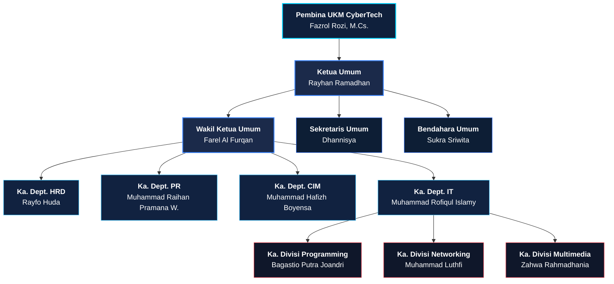

# 🛡️ UKM Cybertech Politeknik Negeri Padang (2026/2027)

> **"Technology Can Unite Anything"**  
> *Makna: Dengan teknologi informasi, kita dapat menyatukan apa pun.*

---

## 📌 Pendahuluan & Sejarah

**UKM Cybertech** adalah Unit Kegiatan Mahasiswa resmi di bawah naungan **Politeknik Negeri Padang (PNP)** yang bergerak di bidang Teknologi Informasi dan Komunikasi.

- **Tanggal Berdiri**: 14 Mei 2009
- **Usia / Generasi**: Memasuki **16 Generasi**, menuju generasi ke-17 di tahun 2026/2027.

---

## 🎯 Visi & Misi

### 👁️ Visi
Menjadikan mahasiswa Politeknik Negeri Padang untuk mencapai standar mutu tertinggi dan berdaya saing di dunia Teknologi Informasi.

### 🎯 Misi
Berfungsi sebagai wadah bagi mahasiswa PNP untuk mengembangkan minat, bakat, dan potensi diri dalam dunia TI secara profesional dan berkarakter.

---

## 🏛️ Struktur Pengurus Harian (DPH 2026/2027)

### 📊 Diagram Grafik Struktur Organisasi (Mermaid Graph)



---

### 🌳 Grafiks Pohon Hierarki (ASCII Tree Graph)

```
                            [ Pembina UKM CyberTech ]
                               Fazrol Rozi, M.Cs.
                                       │
                               [ Ketua Umum ]
                              Rayhan Ramadhan
                                       │
                             [ Wakil Ketua Umum ]
                              Farel Al Furqan
                                       │
         ┌─────────────────────────────┼─────────────────────────────┐
         │                             │                             │
[ Sekretaris Umum ]           [ Bendahara Umum ]           [ 4 Kepala Departemen ]
    Dhannisya                   Sukra Sriwita             ├─ HRD : Rayfo Huda
                                                          ├─ PR  : M. Raihan Pramana W.
                                                          ├─ CIM : M. Hafizh Boyensa
                                                          └─ IT  : M. Rofiqul Islamy
                                                                     │
                                                           [ 3 Kepala Divisi ]
                                                          ├─ Programming : Bagastio P. Joandri
                                                          ├─ Networking  : Muhammad Luthfi
                                                          └─ Multimedia  : Zahwa Rahmadhania
```

---

## 💻 Divisi Spesialisasi

### 1. ⚡ Programming
Mempunyai fokus keahlian pada:
- Website Development (Next.js, React, TypeScript, Node.js)
- Mobile App Development (Flutter, React Native)
- Game Development
- Machine Learning & Dasar Pemrograman

### 2. 🌐 Networking
Mempunyai fokus keahlian pada:
- Konfigurasi Jaringan Komputer (Cisco, Mikrotik)
- Router & Switch Administration
- Cloud Infrastructure & Cyber Security

### 3. 🎨 Multimedia
Mempunyai fokus keahlian pada:
- UI/UX Design & Prototyping
- Desain Grafis & Digital Illustration
- Video Editing & Motion Graphics
- Fotografi & Production

---

## 🏆 Event Utama

### ⚡ Hackathon Nasional
Event tahunan terbesar UKM Cybertech berupa ajang *live coding* selama **24 jam** nonstop untuk membangun sebuah produk perangkat lunak/inovasi digital.  
- **Instagram Event**: [@hackathon_cybertech](https://instagram.com/hackathon_cybertech)

### 📢 Event Lainnya
- Seminar Nasional & Regional TI
- Webinar & Tech Talk
- Workshop & Intensive Coding Bootcamp
- Open Recruitment (Orek) Mahasiswa PNP

---

## 📞 Kontak Resmi

- **Email**: `cybertechpnpofficial@gmail.com`
- **Instagram**: [@cybertech_pnp](https://instagram.com/cybertech_pnp)
- **YouTube**: CyberTech PNP
